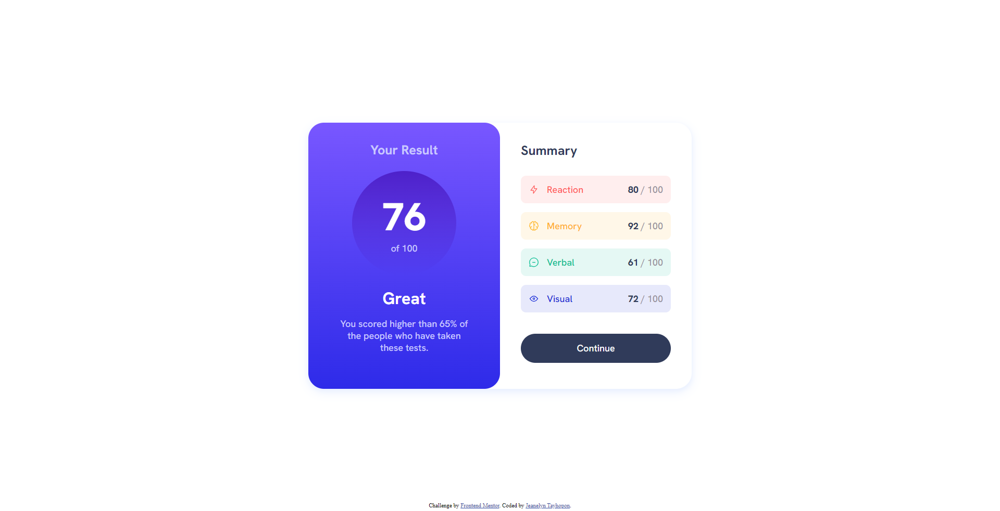
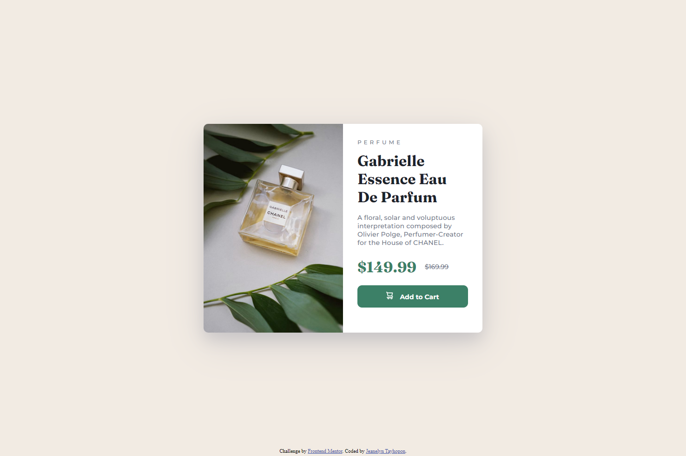

# Frontend Mentor Solutions

This is a compilation of solutions to [Frontend Mentor Challenges](https://www.frontendmentor.io/challenges). Frontend Mentor challenges help you improve your coding skills by building realistic projects.

## Table of contents

- [Challenges](#challenges)
  - [Newbie](#newbie)
- [Author](#author)

## Challenges

### Newbie

| [QR Code Component](https://github.com/jilenski/frontend-mentor-solutions/tree/main/qr-code-component)                           | [Results Summary Component](https://github.com/jilenski/frontend-mentor-solutions/tree/main/results-summary-component)      | [Product Preview Card Component](https://github.com/jilenski/frontend-mentor-solutions/tree/main/product-preview-card-component)     |
| :------------------------------------------------------------------------------------------------------------------------------- | :-------------------------------------------------------------------------------------------------------------------------- | :----------------------------------------------------------------------------------------------------------------------------------- |
|  |  |  |

## Author

- Website - [Jeanelyn Tayhopon](https://jeanelyntayhopon.com/)
- Frontend Mentor - [@jilenski](https://www.frontendmentor.io/profile/jilenski)
- Github - [jilenski](https://github.com/jilenski)
