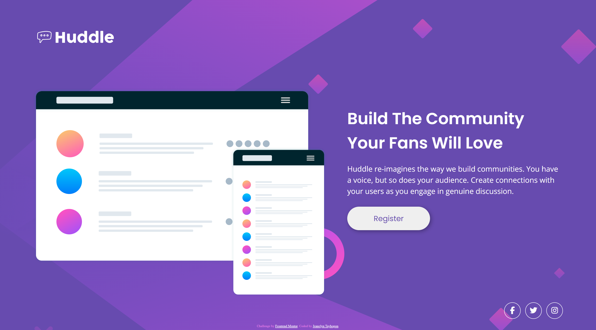
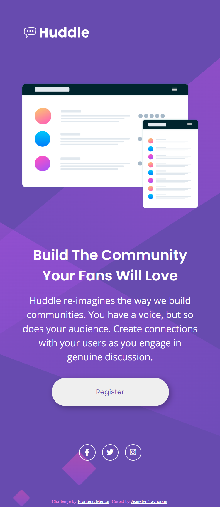

# Frontend Mentor - Huddle landing page with single introductory section solution

This is a solution to the [Huddle landing page with single introductory section challenge on Frontend Mentor](https://www.frontendmentor.io/challenges/huddle-landing-page-with-a-single-introductory-section-B_2Wvxgi0). Frontend Mentor challenges help you improve your coding skills by building realistic projects.

## Table of contents

- [Overview](#overview)
  - [The challenge](#the-challenge)
  - [Screenshot](#screenshot)
  - [Links](#links)
- [My process](#my-process)
  - [Built with](#built-with)
  - [What I learned](#what-i-learned)
  - [Continued development](#continued-development)
  - [Useful resources](#useful-resources)
- [Author](#author)

## Overview

### The challenge

Users should be able to:

- View the optimal layout for the page depending on their device's screen size
- See hover states for all interactive elements on the page

### Screenshots

|       Web View        |     Mobile View      |
| :-------------------: | :------------------: |
|  |  |

### Links

- Solution URL: [Codes](https://github.com/jilenski/frontend-mentor-solutions/tree/main/huddle-landing-page-with-single-introductory-section)
- Live Site URL: [Live View](https://jilenski.github.io/frontend-mentor-solutions.github.io/huddle-landing-page-with-single-introductory-section/index.html)

## My process

### Built with

- Semantic HTML5 markup
- SASS pre-processor
- CSS custom properties
- Mobile-first workflow

### What I learned

- Upon doing this project I learned how to convert a design to HTML markup and style using CSS custom properties.
- I am also using SASS pre-processor to custom CSS.
- I learned how it is easy to custom CSS by doing Mobile-first workflow.
- The design is simple and beginner-friendly and suitable for familiarizing myself with coding a landing page.

### Continued development

- I am currently studying React for frontend development so after this I am planning to convert every component design with React framework.

### Useful resources

- [W3Schools](https://www.w3schools.com/) - This website always helps me with the design and other basic wed development tools. It has all the basics of CSS Styling.
- [Figma](https://www.figma.com/) - This website is a great source of tool for making designs. It also helps me with the CSS Codes and gives me an idea on how to make a custom CSS properties.

## Author

  
  <ul style="list-style-type: none">
    <li>
      <a href="https://jeanelyntayhopon.com/">Jeanelyn Tayhopon</a>
    </li>
    <li>
      &loz; Github - 
      <a href="https://github.com/jilenski">jilenski</a>
    </li>
    <li>
      &loz; Frontend Mentor - 
      <a href="https://www.frontendmentor.io/profile/jilenski">@jilenski</a>
    </li>  
  </ul>

