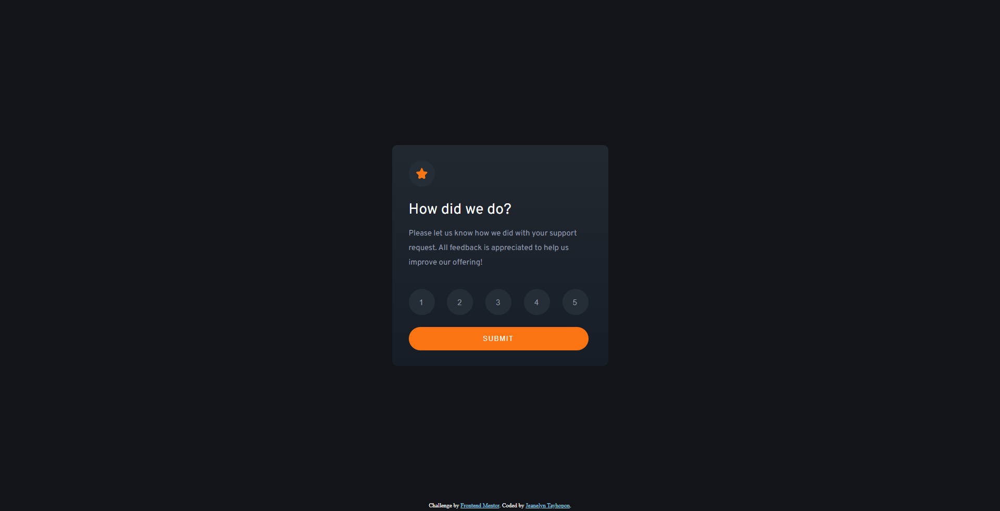

# Frontend Mentor - Interactive rating component solution

This is a solution to the [Interactive rating component challenge on Frontend Mentor](https://www.frontendmentor.io/challenges/interactive-rating-component-koxpeBUmI). Frontend Mentor challenges help you improve your coding skills by building realistic projects. 

## Table of contents

- [Overview](#overview)
  - [The challenge](#the-challenge)
  - [Screenshot](#screenshot)
  - [Links](#links)
- [My process](#my-process)
  - [Built with](#built-with)
  - [What I learned](#what-i-learned)
  - [Continued development](#continued-development)
  - [Useful resources](#useful-resources)
- [Author](#author)

## Overview

### The challenge

Users should be able to:

- View the optimal layout for the app depending on their device's screen size
- See hover states for all interactive elements on the page
- Select and submit a number rating
- See the "Thank you" card state after submitting a rating

### Screenshots

|         Web View         |       Mobile View       |
| :----------------------: | :---------------------: |
|     |     |
|  |  |

### Links

- Solution URL: [Codes](https://github.com/jilenski/frontend-mentor-solutions/tree/main/interactive-rating-component)
- Live Site URL: [Live View](https://jilenski.github.io/frontend-mentor-solutions.github.io/interactive-rating-component/index.html)

## My process

### Built with

- Semantic HTML5 markup
- SASS pre-processor
- CSS custom properties
- Flexbox
- Mobile-first workflow
- Vanilla JavaScript

### What I learned

- Upon doing this project I learned how to convert a design to HTML markup and style using CSS custom properties.
- I am also using SASS pre-processor to custom CSS.
- I learned how it is easy to custom CSS by doing Mobile-first workflow.
- The design is simple and beginner-friendly and suitable for familiarizing myself with coding web components.
- I learned how to manipulate component content or state using Vanilla JavaScript.

### Continued development

- I am planning to add transition effects upon submitting and displaying the acknoledgement message.
- I am currently studying React for frontend development so after this I am planning to convert every component design with React framework.

### Useful resources

- [AI Bard](https://bard.google.com/) - This is my companion throughout my web development journey.
- [W3Schools](https://www.w3schools.com/css/) - This website always helps me with the design. It has all the basics of CSS Styling.
- [Figma](https://www.figma.com/) - This website is a great source of tool for making designs. It also helps me with the CSS Codes and gives me an idea on how to make a custom CSS properties.

## Author

|  | Website - [Jeanelyn Tayhopon](https://jeanelyntayhopon.com/) Frontend Mentor - [@jilenski](https://www.frontendmentor.io/profile/jilenski)  Github - [jilenski](https://github.com/jilenski) |
| -------------------------------------------------------------------------------------------------------------------------------------------------------------------------------------------------------------------------------------------- | :------------------------------------------------------------------------------------------------------------------------------------------------------------------------------------------------- |
