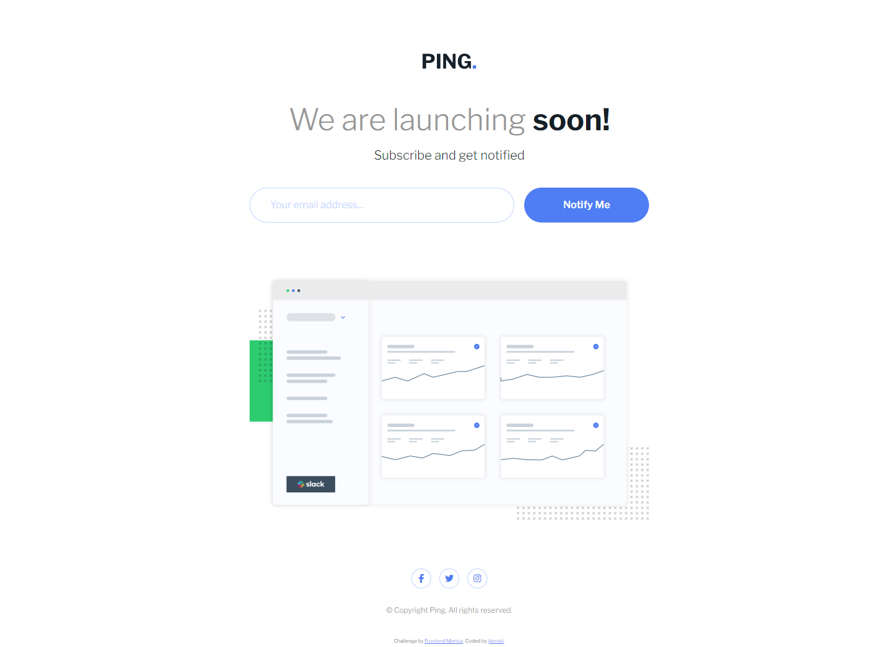
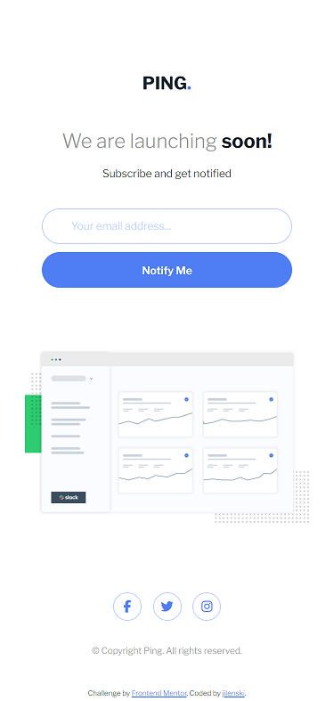

# Frontend Mentor - Ping coming soon page solution

This is a solution to the [Ping coming soon page challenge on Frontend Mentor](https://www.frontendmentor.io/challenges/ping-single-column-coming-soon-page-5cadd051fec04111f7b848da). Frontend Mentor challenges help you improve your coding skills by building realistic projects.

## Table of contents

- [Overview](#overview)
  - [The challenge](#the-challenge)
  - [Screenshot](#screenshot)
  - [Links](#links)
- [My process](#my-process)
  - [Built with](#built-with)
  - [What I learned](#what-i-learned)
  - [Continued development](#continued-development)
  - [Useful resources](#useful-resources)
- [Author](#author)

## Overview

### The challenge

### The challenge

Users should be able to:

- View the optimal layout for the site depending on their device's screen size
- See hover states for all interactive elements on the page
- Submit their email address using an `input` field
- Receive an error message when the `form` is submitted if:
  - The `input` field is empty. The message for this error should say _"Whoops! It looks like you forgot to add your email"_
  - The email address is not formatted correctly (i.e. a correct email address should have this structure: `name@host.tld`). The message for this error should say _"Please provide a valid email address"_

### Screenshots

|          Web View          |        Mobile View        |
| :------------------------: | :-----------------------: |
|  |  |

### Links

- Solution URL: [Codes](https://github.com/jilenski/frontend-mentor-solutions/tree/main/ping-coming-soon-page)
- Live Site URL: [Live View](https://jilenski.github.io/frontend-mentor-solutions.github.io/ping-coming-soon-page/build/index.html)

## My process

### Built with

- Semantic HTML5 markup
- CSS custom properties
- Mobile-first workflow
- SASS pre-processor | 7-1 architecture
- Vanilla JavaScript ES6 Modules

### What I learned

- Through this project, I gained skills in converting designs to HTML using CSS custom properties.
- Additionally, I employed the SASS pre-processor for CSS customization, adopting a Mobile-first workflow for easy styling.
- Organizing my SASS modules using the SASS 7-1 architecture enhanced readability.
- Using JavaScript, I learned how to validate input to meet certain conditions.
- The design, being simple and beginner-friendly, served as a valuable exercise for coding a landing page.

### Continued development

- I am currently studying React for frontend development so after this I am planning to convert every component design with React framework or any other JavaScript framework.

### Useful resources

- [W3Schools](https://www.w3schools.com/) - This website always helps me with the design and other basic wed development tools. It has all the basics of CSS Styling.
- [Figma](https://www.figma.com/) - This website is a great source of tool for making designs. It also helps me with the CSS Codes and gives me an idea on how to make a custom CSS properties.

## Author

  
  <ul style="list-style-type: none">
    <li>
      <a href="https://jeanelyntayhopon.com/">Jeanelyn Tayhopon</a>
    </li>
    <li>
      &loz; Github - 
      <a href="https://github.com/jilenski">jilenski</a>
    </li>
    <li>
      &loz; Frontend Mentor - 
      <a href="https://www.frontendmentor.io/profile/jilenski">@jilenski</a>
    </li>  
  </ul>

