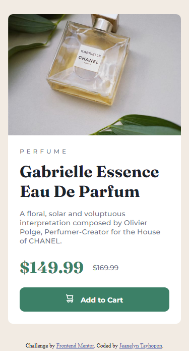

# Frontend Mentor - Product preview card component solution

This is a solution to the [Product preview card component challenge on Frontend Mentor](https://www.frontendmentor.io/challenges/product-preview-card-component-GO7UmttRfa). Frontend Mentor challenges help you improve your coding skills by building realistic projects.

## Table of contents

- [Overview](#overview)
  - [The challenge](#the-challenge)
  - [Screenshot](#screenshot)
  - [Links](#links)
- [My process](#my-process)
  - [Built with](#built-with)
  - [What I learned](#what-i-learned)
  - [Continued development](#continued-development)
  - [Useful resources](#useful-resources)
- [Author](#author)

## Overview

### The challenge

Users should be able to:

- View the optimal layout depending on their device's screen size
- See hover and focus states for interactive elements

### Screenshots

|       Web View        |     Mobile View      |
| :-------------------: | :------------------: |
|  |  |

### Links

- Solution URL: [Codes](https://github.com/jilenski/frontend-mentor-solutions/tree/main/product-preview-card-component)
- Live Site URL: [Live View](https://frontend-mentor-solution-product-preview-card-component.vercel.app/)

## My process

### Built with

- Semantic HTML5 markup
- SASS pre-processor
- CSS custom properties
- Flexbox
- Mobile-first workflow

### What I learned

- I have a free-subscription so before I started to make the code I first convert the .jpg designs to Figma design. By doing this, I was able to code the stylesheet easily.
- Upon doing this project I learned how to convert a design to HTML markup and style using CSS custom properties.
- I am also using SASS to easily custom CSS.
- I learned how it is easy to custom CSS by doing Mobile-first workflow.
- The design is simple and beginner-friendly and suitable for familiarizing myself with coding web components.

### Continued development

- I am currently studying React for frontend development so after this I am planning to convert every component design with React framework.

### Useful resources

- [AI Bard](https://bard.google.com/) - This is my companion throughout my web development journey.
- [W3Schools](https://www.w3schools.com/css/) - This website always helps me with the design. It has all the basics of CSS Styling.
- [Figma](https://www.figma.com/) - This website is a great source of tool for making designs. It also helps me with the CSS Codes and gives me an idea on how to make a custom CSS properties.
- [SASS Tutorial](https://www.youtube.com/watch?v=_a5j7KoflTs) - This video from freeCodeCamp.org channel helps me alot to understand SASS pre-processor.

## Author

|  | Website - [Jeanelyn Tayhopon](https://jeanelyntayhopon.com/) Frontend Mentor - [@jilenski](https://www.frontendmentor.io/profile/jilenski)  Github - [jilenski](https://github.com/jilenski) |
| -------------------------------------------------------------------------------------------------------------------------------------------------------------------------------------------------------------------------------------------- | :------------------------------------------------------------------------------------------------------------------------------------------------------------------------------------------------- |
