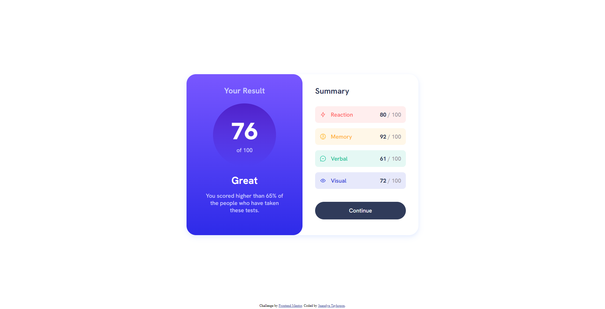

# Frontend Mentor - Results summary component solution

This is a solution to the [Results summary component challenge on Frontend Mentor](https://www.frontendmentor.io/challenges/results-summary-component-CE_K6s0maV). Frontend Mentor challenges help you improve your coding skills by building realistic projects. 

## Table of contents

- [Overview](#overview)
  - [Screenshot](#screenshot)
  - [Links](#links)
- [My process](#my-process)
  - [Built with](#built-with)
  - [What I learned](#what-i-learned)
  - [Continued development](#continued-development)
  - [Useful resources](#useful-resources)
- [Author](#author)

## Overview

### The challenge

Users should be able to:

- View the optimal layout for the interface depending on their device's screen size
- See hover and focus states for all interactive elements on the page
- **Bonus**: Use the local JSON data to dynamically populate the content

### Screenshots

| Web View | Mobile View |
| :------: | :---------: |
|  |  |

### Links

- Solution URL: [Codes](https://github.com/jilenski/frontend-mentor-solutions/tree/main/results-summary-component)
- Live Site URL: [Live View](https://frontend-mentor-solution-results-summary-component.vercel.app/)

## My process

### Built with

- Semantic HTML5 markup
- SASS pre-processor
- CSS custom properties
- Flexbox
- Mobile-first workflow
- Vanilla JavaScript

### What I learned

- I have a free-subscription so before I started to make the code I first convert the .jpg designs to Figma design. By doing this, I was able to code the stylesheet easily.
- Upon doing this project I learned how to convert a design to HTML markup and style using CSS custom properties.
- I learned how to use Vanilla JavaScript to iterate data from JSON file. I also was able to manipulate data from JSON file to use for my components.
- I am also not familiar with using SASS before but now I can easily custom CSS by using pre-processor.
- I learned how it is easy to custom CSS by doing Mobile-first workflow.
- The design is simple and beginner-friendly and suitable for familiarizing myself with coding web components.

Below JavaScript function is what I used to dynamically populate the content:

```js
async function getSummaries() {
  const res = await fetch('data.json');
  const data = await res.json();

  data.forEach((card) => {
    const cardEl = document.createElement('div');
    cardEl.classList.add('card');
    cardEl.style.color = `hsl(${card.color})`;
    cardEl.style.backgroundColor = `hsla(${card.color}, 0.1)`;

    summaryItems.push(cardEl);

    cardEl.innerHTML = `
      <div class='card-category'>  
        
        <p>${card.category}</p>
      </div>
      <div class='card-score'>
        <p>${card.score} <span>/ 100</span></p>
      </div>
    `;

    cardsContainer.appendChild(cardEl);
  });
}
```

### Continued development

- I am currently studying React for frontend development so after this I am planning to convert every component design with React framework.

### Useful resources

- [AI Bard](https://bard.google.com/) - This is my companion throughout my web development journey.
- [W3Schools](https://www.w3schools.com/css/) - This website always helps me with the design. It has all the basics of CSS Styling.
- [Figma](https://www.figma.com/) - This website is a great source of tool for making designs. It also helps me with the CSS Codes and gives me an idea on how to make a custom CSS properties.
- [SASS Tutorial](https://www.youtube.com/watch?v=_a5j7KoflTs) - This video from freeCodeCamp.org channel helps me alot to understand SASS pre-processor.

## Author

- Website - [Jeanelyn Tayhopon](https://jeanelyntayhopon.com/)
- Frontend Mentor - [@jilenski](https://www.frontendmentor.io/profile/jilenski)
- Github - [jilenski](https://github.com/jilenski)
